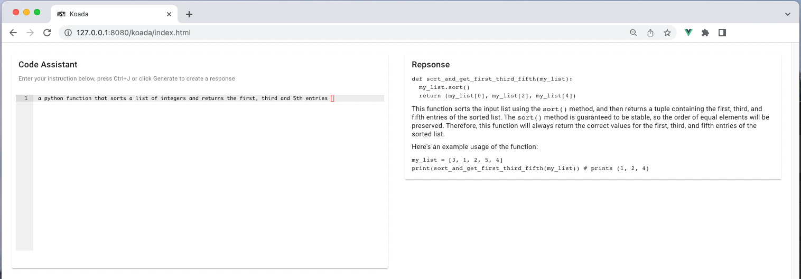

This is an ultra simple front end that is designed to interface with [llama.cpp](https://github.com/ggerganov/llama.cpp).
It lets you write instructions for the model to complete and serves back the responses to you
in an adjacent pane.

I wrote this because I wanted a super basic way to use llama2-code in my daily work but could not find any 
interface that wasn't cluttered with tuning options and other also gave the simple affordances I wanted, 
such as vim keybindings and markdown rendering of outputs.

How it looks:



## Project setup

Clone the project into the `examples/server` directory of [llama.cpp](https://github.com/ggerganov/llama.cpp):

```bash
git clone https://github.com/ggerganov/llama.cpp.git && cd llama.cpp && make && \
cd examples/server && git clone https://github.com/ssadedin/koada.git
```

**Note**:
Since originally created, llama.cpp has stopped supporting the modeul format for the codellama13b model
mentioned below. To run older models, check out the older version of the code and compile it:

```
# for older GGUFv1 models only
git checkout abd21fc && make clean && make
```

**Note**: for great performance on Apple Silicon machines, add `LLAMA_METAL=1` environment variable.

Now install modules and then build:

```
# npm
npm install

npm run build
```

**Note**: that this will automatically output to the `server/public/koada` directory so the files are ready for 
use. If you want to place the koada in a different location then you will need to adjust the base path
set in `vite.config.ts`.

Download a model:

```
cd ../..

mkdir models && cd models && \
wget 'https://huggingface.co/TheBloke/CodeLlama-13B-GGUF/resolve/main/codellama-13b-instruct.Q5_K_M.gguf'

cd ../..
```

Note that this code is specifically designed to work with the _instruct_ models so always look for models
with that fine tuning. These are models that use prompts in the form `[INSTR]....[/INSTR]`.

## Running

Run the llama.cpp server using the standard server command:

```
./server -t 10 -m  ./models/codellama-13b-instruct.Q5_K_M.gguf  -c 4096  
```

Note: above uses 10 cores. For GPU acceleration on Apple Silicon, add the `-ngl` parameter:

```
./server -t 10 -ngl 32 -m  ./models/codellama-13b-instruct.Q5_K_M.gguf  -c 4096  
```

You can now access koada using the URL:

http://127.0.0.1:8080/koada/index.html


### Compiles and hot-reloads for development

```
# npm
npm run dev
```

### Compiles and minifies for production

```
# npm
npm run build
```

### Customize configuration

See [Configuration Reference](https://vitejs.dev/config/).
